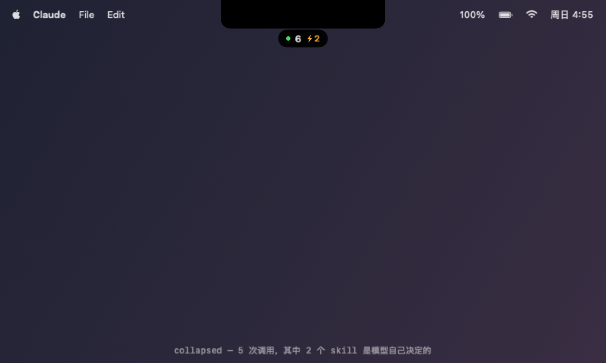

# SkillMonitor

[](https://github.com/mixx993/skill-monitor/actions/workflows/ci.yml)

**English** · [中文](README.zh-CN.md)

A Dynamic Island for Claude Code. It hangs under your MacBook's notch and shows
which skills and MCP tools the current task is using — and, for skills, whether
you asked for them or the model reached for them on its own.


## Why

Claude Code already prints every skill and MCP invocation, but they scroll past
in the tool-call stream. There is no per-task summary, and a skill the model
decided to load on its own looks exactly like one you typed `/name` for. If you
have a couple of dozen skills installed, you stop noticing either.

SkillMonitor answers one question at a glance: *what is this task actually
reaching for right now, and how much of that did I ask for?*

## Install

macOS 13+ and Claude Code. The hooks come from this repository either way, so
start by cloning it.

```bash
git clone https://github.com/mixx993/skill-monitor.git
cd skill-monitor
./install.sh
```

`install.sh` compiles the app, registers five hooks in `~/.claude/settings.json`
(backing up your existing file first), and launches the island. Re-running it is
safe — it replaces its own hooks and leaves everything else alone.

Compiling needs Xcode or the Command Line Tools (`xcode-select --install`).
**Without them**, drop a [release build](../../releases/latest) in place first and
the installer will use it:

```bash
mkdir -p dist
unzip ~/Downloads/SkillMonitor-*.zip -d dist
./install.sh
```

Release builds are universal (arm64 + x86_64) but **ad-hoc signed, not notarized**
— there is no Apple Developer certificate behind this project. macOS quarantines
them on download, so `install.sh` clears that flag for you (`xattr -dr
com.apple.quarantine`). If you would rather not have a binary from the internet
run on your machine, compile from source: that path is never quarantined.

Remove everything with `./uninstall.sh`.

## What you see

| State | Looks like | When |
|---|---|---|
| collapsed | `● 5 ⚡2` | Idle. Green dot = task running, grey = finished |
| flash | `docs / guide  2.2s` | A call just landed; collapses after 2.2s |
| expanded | the full list | Pointer is on the island |



- Filled purple ◆ is a skill, hollow teal ◇ is an MCP tool (shown as `server / tool`)
- An **amber pip** means the model reached for that skill on its own. The `⚡N`
  on the collapsed pill counts those.
- The right-hand figure is the call's **duration**, falling back to a timestamp
  when it isn't known yet.
- Under the calls, **the instruction files in effect for the session**: global,
  project and nested `CLAUDE.md` (including files pulled in with `@import`),
  auto-memory, and settings — each with a short content fingerprint. Click the
  summary line to expand it.
- The island only appears while Claude is frontmost, so it is not in your way
  in a browser.

## How it works

Five hooks feed one state file that the app polls:

| Hook | Matcher | Does |
|---|---|---|
| `UserPromptSubmit` | — | Starts a new task (sync, so it lands before the first tool call) |
| `PreToolUse` | `Skill\|mcp__.*` | Appends a call (async, no added latency) |
| `PostToolUse` | `Skill\|mcp__.*` | Attaches the call's duration |
| `Stop` | — | Marks the task finished |
| `InstructionsLoaded` | — | Records a `CLAUDE.md` loaded mid-session |

```
~/.claude/skill-monitor/
├── sessions/<session_id>.json   per-session ledger
├── state.json                   a copy of whichever session was touched last
├── config.json                  which apps the island shows for
└── history.jsonl                append-only log across all sessions
```

Find skills you installed and never use:

```bash
jq -r 'select(.kind=="skill") | .name' ~/.claude/skill-monitor/history.jsonl \
  | sort | uniq -c | sort -rn
```

## Instruction files

Skills and MCP tools are only part of what shapes a result. `CLAUDE.md`, memory
and settings are read on every turn, never appear as a tool call, and are the
most common reason the same request behaves differently on another machine —
silently, with no error.

At the start of each task the hook lists the files Claude Code would load for
that directory: `~/.claude/CLAUDE.md`, every `CLAUDE.md` / `.claude/CLAUDE.md` /
`CLAUDE.local.md` from the filesystem root down to the working directory, the
session's `memory/MEMORY.md`, and the user / project / local `settings.json`.
Files that only load later — a nested `CLAUDE.md` read when Claude opens a file
in that subdirectory, or one pulled in with `@AGENTS.md` — arrive through the
`InstructionsLoaded` event and stay listed for the rest of the session.

Each file gets a 7-character SHA-256 fingerprint. Comparing two machines means
comparing those codes: same code, same file.

What this cannot show: Claude Code's own built-in system prompt, which is not a
file and changes with the Claude Code version; and how much any one file
actually changed the outcome.

## Notes from building it

Four things were not obvious, and are the reason the code looks the way it does.

**`UserPromptSubmit` is not "the user pressed enter".** It also fires for things
the harness injects — background task completions, system reminders, CI events.
Without filtering, a single background task resets your task and renders raw XML
as the prompt. See `is_injected()`.

**One state file is not enough.** With several sessions open, a prompt submitted
in session A takes ownership of tool calls made in session B, so the header and
the list describe different tasks. Each session keeps its own ledger and
republishes itself; the island shows whichever was touched last.

**SwiftUI's `.onHover` never fires here.** The app is an `.accessory` app that
never activates, and `.onHover` only works for the active app. Hovering uses an
`NSTrackingArea` registered `.activeAlways` instead.

**Origin has to be decided at the prompt, not at the tool call.** A skill invoked
as `/name` may be expanded by the harness and never reach `PreToolUse`, so the
slash command is recorded the moment the prompt arrives. If the model then calls
that same skill, the row is *claimed* rather than counted twice. Built-ins like
`/model` are told apart by looking for a matching `SKILL.md`, not by keeping a
list of built-in commands.

## Developing

`tools/preview/` renders the view offscreen to PNG over a mock notched desktop,
so the design can be iterated without screen-recording permission or a running
Claude session:

```bash
swiftc -O -framework AppKit -framework SwiftUI \
  -o dist/preview-tool app/Island.swift tools/preview/main.swift
./dist/preview-tool docs
```

| File | Role |
|---|---|
| `hook/log.py` | Hook adapter — the only Claude-Code-specific part |
| `app/Island.swift` | The island view and state polling |
| `app/main.swift` | Window layer: transparent, above the menu bar, notch-aware |
| `tools/preview/` | Offscreen renderer for design work |
| `tests/test_hook.py` | Behavioural tests for the hook |

The app knows nothing about Claude Code — it renders one JSON file. Pointing it
at another agent means writing another adapter, not touching the app.

## Tests

```bash
python3 tests/test_hook.py
```

Runs `hook/log.py` as a subprocess against a throwaway `HOME`, so it cannot
touch a real `~/.claude`. Covers dedup, origin attribution, the claim rule,
duration capture, injected-prompt filtering, session isolation, and
instruction-file discovery and fingerprinting. CI runs
these plus a universal build on every push.

## License

MIT
