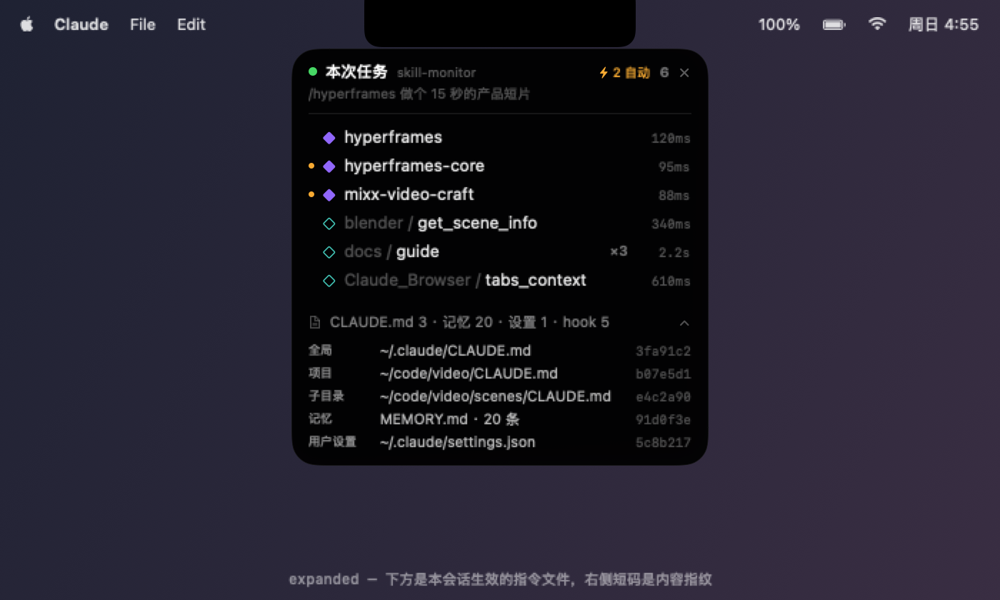

# SkillMonitor

[](https://github.com/mixx993/skill-monitor/actions/workflows/ci.yml)

[English](README.md) · **中文**

一个给 Claude Code 用的灵动岛。挂在刘海下方，显示当前任务用了哪些 skill 和 MCP——
skill 还会标出是你要求的，还是模型自己决定调的。



## 为什么做这个

Claude Code 本来就会把每次 skill 和 MCP 调用打出来，但它们淹在工具调用流里往上滚。
没有按任务维度的汇总，而且模型自己决定加载的 skill，跟你手打 `/name` 调的长得一模一样。
装了几十个 skill 之后，两者你都不会再注意。

## 安装

需要 macOS 13+ 和 Claude Code。hook 必须从这个仓库来，所以无论哪条路都先 clone。

```bash
git clone https://github.com/mixx993/skill-monitor.git
cd skill-monitor
./install.sh
```

`install.sh` 会编译 app、往 `~/.claude/settings.json` 里注册 5 个 hook（先备份你原有的）、然后启动岛。
重复跑是安全的——只替换自己的 hook，不动其他。

编译需要 Xcode 或命令行工具（`xcode-select --install`）。**没装的话**，先把
[预编译包](../../releases/latest)放进去，安装脚本会直接用它：

```bash
mkdir -p dist
unzip ~/Downloads/SkillMonitor-*.zip -d dist
./install.sh
```

预编译包是通用二进制（arm64 + x86_64），但**只做了 ad-hoc 签名，没有公证**——这个项目背后
没有 Apple 开发者证书。macOS 会给下载来的包打隔离标记，`install.sh` 会帮你清掉
（`xattr -dr com.apple.quarantine`）。不放心从网上下二进制的话，就从源码编译——那条路不会被隔离。

卸载：`./uninstall.sh`

## 组成

| 文件 | 作用 |
|---|---|
| `hook/log.py` | Claude Code hook：把调用写进 `~/.claude/skill-monitor/state.json` |
| `app/Island.swift` | 灵动岛视图 + 状态轮询（0.3 秒） |
| `app/main.swift` | 窗口层：透明、无边框、菜单栏之上、贴刘海 |
| `tools/preview/main.swift` | 离屏渲染预览图 |
| `tests/test_hook.py` | hook 的行为测试 |
| `install.sh` | 编译 + 注册 hook + 启动（一键） |
| `build.sh` | 只编译出 `dist/SkillMonitor.app` |
| `uninstall.sh` | 从 settings.json 摘掉 hook 并退出 app |

## 工作原理

三个 hook 写进 `~/.claude/settings.json`：

- `UserPromptSubmit` → 清空状态，开一轮新任务（同步，确保早于第一个工具调用）

  ⚠️ 这个事件**不只在你打字时触发**：后台任务完成通知、system-reminder、CI 事件等 harness 往会话里注入的内容也算一次提交。
  `log.py` 里的 `is_injected()` 把它们挡掉（识别 `<task-notification`、`<system-reminder`、
  `[SYSTEM NOTIFICATION` 等开头），否则一条后台通知就会把计数清零、并把原始 XML 当提示词显示出来。
- `PreToolUse`，matcher `Skill|mcp__.*` → 记一条调用（异步，不增加延迟）
- `PostToolUse`，同样的 matcher → 把该次调用的耗时补上（载荷里直接带了 `duration_ms`，不用自己计时）
- `Stop` → 把状态标成 done（绿点变灰）
- `InstructionsLoaded` → 会话中途加载的 `CLAUDE.md`（子目录、`@` 引用）补进指令列表

### 指令文件

skill 和 MCP 只是影响结果的一部分。`CLAUDE.md`、记忆、设置每一轮都会被读进去，但永远不会以工具调用的形式出现。
同一个请求换台电脑表现不一样，最常见的原因就在这里，而且不会报任何错。

每个任务开始时，hook 按 Claude Code 的加载规则列出该目录下生效的文件：`~/.claude/CLAUDE.md`、
从根目录一路到工作目录的每一层 `CLAUDE.md` / `.claude/CLAUDE.md` / `CLAUDE.local.md`、
本会话的 `memory/MEMORY.md`、用户级 / 项目级 / 本地的 `settings.json`。

有些文件是中途才加载的：Claude 打开某个子目录里的文件时，那一层的 `CLAUDE.md` 才会被读进来；
或者 `CLAUDE.md` 里用 `@AGENTS.md` 引用了别的文件。这些通过 `InstructionsLoaded` 事件补进来，
并在整个会话里保留。

每个文件有一个 7 位的 SHA-256 指纹。比较两台电脑，就是比较这些短码：短码相同，文件就相同。

看不到的：Claude Code 自己的内置系统提示（不是文件，随版本变化）；以及某个文件对结果的实际影响有多大。

### 谁决定调的

- 你手打 `/skill-name` → `origin: "user"`。这一条在 `UserPromptSubmit` 里就记下了，
  因为斜杠调用的 skill **可能被 harness 直接展开、根本不走 Skill 工具**，光靠 `PreToolUse` 会漏。
  如果随后模型又真的调了一次同名 Skill，那次会被认领（`claimed`）而不重复计数。
- 模型自己调的 → `origin: "auto"`，列表里打琥珀点。
- MCP 工具不打点——它们本来就全是模型选的，全标等于没标。

`/model`、`/status` 这类内置命令不算一轮任务（不重置岛）。区分方式是查有没有对应的
`SKILL.md`（找 `~/.claude/skills/`、`~/.claude/plugins/**/skills/`、项目 `.claude/skills/`），
而不是维护一份内置命令黑名单。

多个 Claude Code 会话同时开着时，**每个会话写自己的 `sessions/<id>.json`**，每次写完再把自己发布到
`state.json`。所以岛上永远是最近活跃的那个任务，而且提示词和调用列表必定来自同一个会话。
（共用单文件时，A 会话的提示词会配上 B 会话的调用。）会话文件超过 24 小时或 40 个自动清理。

重复调用同一个 skill 会合并成 `×N`，不会刷屏。

## 数据

- `~/.claude/skill-monitor/sessions/<session_id>.json` — 每个会话各自的账本
- `~/.claude/skill-monitor/state.json` — **最近活跃**的那个会话的副本，岛只读它
- `~/.claude/skill-monitor/history.jsonl` — 跨会话流水（带 session_id、cwd），超过 2MB 自动轮转

用来统计「哪些 skill 装了但从没用过」：

```bash
cut -d'"' -f16 ~/.claude/skill-monitor/history.jsonl | sort | uniq -c | sort -rn
```

## 界面：灵动岛

挂在刘海正下方（无刘海的机器则嵌进菜单栏中间的空位），三个状态之间弹簧过渡：

| 状态 | 样子 | 触发 |
|---|---|---|
| collapsed | `● 5` 小胶囊 | 空闲。绿点=任务进行中，灰点=已结束 |
| flash | `docs / guide  04:53:44` | 新调用落地，2.2 秒后自动收回 |
| expanded | 完整列表 | 鼠标移上去 |

- 窗口层级在菜单栏之上、全空间跟随、永不抢焦点；透明区域点击直接穿透到下面的窗口
- 紫色实心 ◆ = skill，青色空心 ◇ = MCP（显示成 `服务器 / 工具名`）
- **琥珀色小点** = 这个 skill 是模型自己决定调的，你没要求过；折叠态的 `⚡N` 是这类调用的个数
- 右侧数字是**耗时**（`2.2s` / `340ms`），没拿到耗时时退回显示时间点
- 调用列表下方是**本会话生效的指令文件**：全局、项目、子目录的 `CLAUDE.md`（包括用 `@` 引用进来的文件）、
  自动记忆、设置文件，每个带一个内容指纹。点摘要那一行展开明细。
- 退出：展开后点右上角 `×`，或在岛上右键 → 退出

### 只在 Claude 前台时显示

切到 Chrome、微信等其他 app 时岛会淡出并 `orderOut`（完全离开屏幕，不只是透明），切回来再淡入。
靠 `NSWorkspace.didActivateApplicationNotification` 监听前台 app 切换。

白名单在 `~/.claude/skill-monitor/config.json`，首次启动自动生成：

```json
{
  "showWhenFrontmost": ["com.anthropic.claudefordesktop"]
}
```

在终端里跑 CLI 版 Claude Code 的话，把终端的 bundle id 加进去（`com.apple.Terminal`、
`com.googlecode.iterm2`、`com.mitchellh.ghostty` 等），改完重启 app。

预览图在 `docs/`，由 `tools/preview/main.swift` 离屏渲染生成（不需要截屏权限）：

```bash
swiftc -O -framework AppKit -framework SwiftUI -o dist/preview-tool app/Island.swift tools/preview/main.swift
./dist/preview-tool docs
```

## 开机自启

系统设置 → 通用 → 登录项 → `+` → 选 `dist/SkillMonitor.app`

## 测试

```bash
python3 tests/test_hook.py
```

用一个临时 `HOME` 跑 `hook/log.py` 子进程，碰不到真实的 `~/.claude`。覆盖去重、origin 归属、
认领规则、耗时捕获、注入提示词过滤、会话隔离。CI 每次推送都会跑这些 + 通用二进制编译。

## 注意

hook 里写的是本目录的绝对路径。**移动这个文件夹后要改 `~/.claude/settings.json` 里的三条命令**，或者重跑安装。
